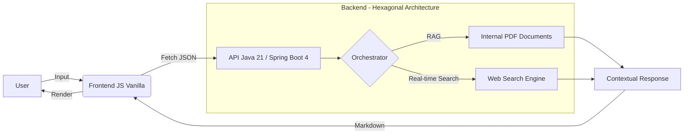

# Hybrid-Intel Interface 🤖🌐

[](https://developer.mozilla.org/en-US/docs/Web/HTML)
[](https://tailwindcss.com/)
[](https://developer.mozilla.org/en-US/docs/Web/JavaScript)
[](https://render.com/)

**Hybrid-Intel Interface** es la cara visible de un ecosistema de inteligencia artificial de vanguardia. Se trata de una interfaz minimalista, ultrarrápida y reactiva diseñada para interactuar con un **Orquestador de IA** de alto rendimiento, permitiendo a los usuarios realizar consultas complejas sobre documentos internos y la web en tiempo real.

---

## 🏛️ Arquitectura del Ecosistema

El sistema sigue un flujo de datos optimizado desde la entrada del usuario hasta la generación de la respuesta enriquecida mediante técnicas de **RAG (Retrieval-Augmented Generation)** y búsqueda web activa.



---

## ✨ Características Principales

- **🩺 Real-time Health Check:** Monitorización constante del estado del backend mediante la integración con **Spring Boot Actuator**, mostrando un indicador visual de disponibilidad en tiempo real.
- **💡 Dynamic Suggestion System:** Sistema de tarjetas de sugerencias contextuales basadas en el dominio del proyecto para guiar al usuario en sus primeras interacciones.
- **📝 Markdown & Code Support:** Renderizado fluido de respuestas enriquecidas, incluyendo tablas, listas y bloques de código con sintaxis resaltada gracias a `Marked.js`.
- **🚀 Ultra-Minimalist UI:** Interfaz enfocada en la legibilidad y la experiencia de usuario, eliminando distracciones y optimizando la velocidad de carga.

---

## 🛠️ Instalación y Configuración

Sigue estos pasos para desplegar el entorno de desarrollo localmente:

### 1. Clonar el repositorio
```bash
git clone https://github.com/tu-usuario/hybrid-intel-interface.git
cd hybrid-intel-interface
```

### 2. Configuración de API_BASE
Para entornos de producción o pruebas con un backend específico, localiza la constante `API_BASE` en el archivo `assets/js/app.js` y actualízala con la URL de tu API:

```javascript
// assets/js/app.js
const API_BASE = 'https://tu-api-backend.com/api/v1';
```

### 3. Ejecución
Al ser una aplicación basada en **Vanilla JS**, no requiere compilación. Puedes abrir el archivo `index.html` directamente en tu navegador o utilizar una extensión de servidor local (como *Live Server* en VS Code).

---

## ⚙️ Enfoque de Ingeniería

La decisión de utilizar **JavaScript Vanilla** y **Tailwind CSS** no fue estética, sino una decisión arquitectónica orientada al rendimiento:

1.  **Zero Overhead:** Al evitar frameworks pesados (como React o Angular), reducimos el tiempo de *Time to Interactive* (TTI) al mínimo, algo crucial para un asistente de IA que debe sentirse instantáneo.
2.  **Mantenibilidad:** La arquitectura es limpia y directa, facilitando la integración con cualquier backend que exponga una interfaz RESTful.
3.  **Peso Pluma:** La ausencia de dependencias externas (más allá de las librerías de utilidad vía CDN) garantiza una carga extremadamente rápida incluso en condiciones de red limitadas.

---

Desarrollado con precisión técnica para la orquestación de inteligencia artificial híbrida.
